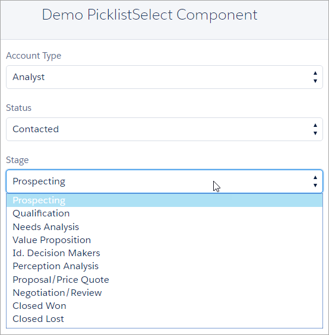

# Lightning Picklist Field Select Component

Lightning Component that renders `lightning:select` with options from an sobject picklist field. Ideally, this component shouldn't be needed but as of Winter '16 release the `force:inputField` component has a [bug that when used with picklist fields it renders disabled](https://success.salesforce.com/issues_view?id=a1p3A0000001BaTQAU). Disabled form fields are not conducive to users entering data.

<a href="https://githubsfdeploy.herokuapp.com">
  
</a>



# Usage

The simplest way is to use the component and specify `objectName` and `fieldName` required attributes:

```
<c:PicklistSelect objectName="Account" fieldName="Type"/>
```

Since the standard [lightning:select](https://developer.salesforce.com/docs/atlas.en-us.lightning.meta/lightning/aura_compref_lightning_select.htm) component is used by this component, most of the standard attributes are available to you as well:

| Attribute | Description | Required? |
|-----------|-------------|-----------|
| objectName | API name of object | yes |
| fieldName | API name of picklist field | yes |
| label     | Text that describes the desired select input. Default is the field's label. | no |
| value     | The value of the select, also used as the default value to select the right option during init. If no value is provided, the first option will be selected. | no |
| class     | A CSS class that will be applied to the outer element. This style is in addition to base classes associated with the component. | no
| onblur    | The action triggered when the element releases focus. | no |
| onfocus   | The action triggered when the element receives focus. | no |
| onchange  | The action triggered when a value attribute changes. | no |
